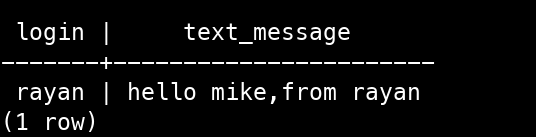
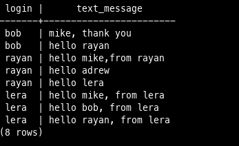

```sql
select
  login,
  (
    select text_message
    from data_messages
    where (select messages.id_message from messages where messages.id_sender=users.id_user and (time_message between '08:00:00' and '10:00:00'))=data_messages.id_message
    limit 1
  )
from users
where(
  (
    (
    select count(time_message)
    from messages
    where (id_sender=users.id_user) and (time_message between '08:00:00' and '10:00:00') 
    )>0
  )
  and
  (
    (
    select color_scheme
    from users_information
    where users_information.id_user=users.id_user
    )='dark'
  )

);
```

Выполнение запроса:<br/>


```sql
select login, text_message
from users,users_information,messages,data_messages
where
  (messages.time_message between '08:00:00' and '22:00:00')
  and users_information.color_scheme='dark'
  and users_information.id_user=users.id_user
  and messages.id_sender=users.id_user
  and data_messages.id_message=messages.id_message
  and data_messages.text_message!='none';
```

Выполнение запроса:<br/>



